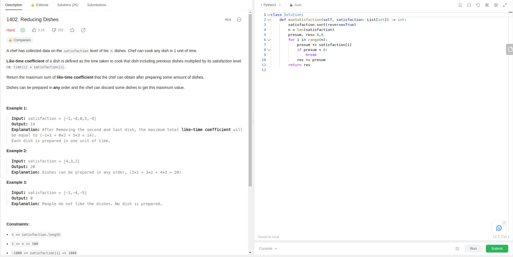
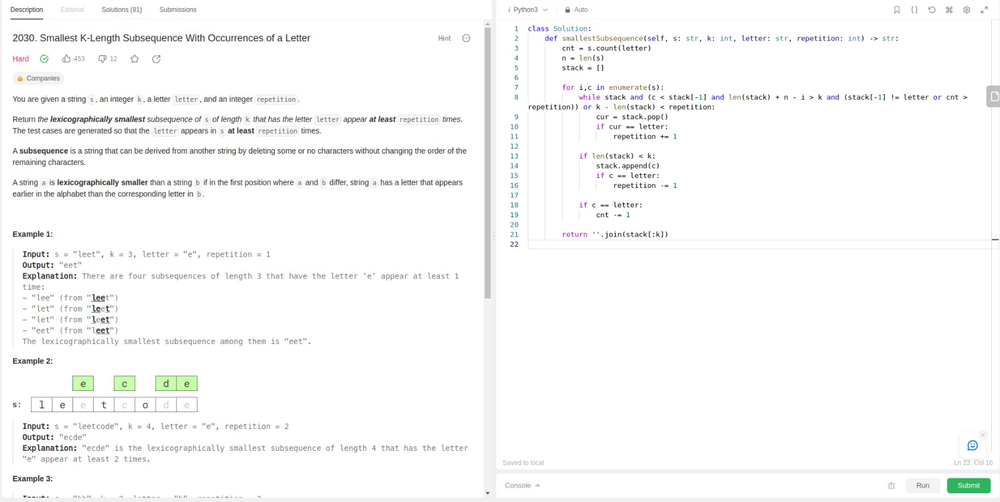

# Greedy_LeetProblems

# LeetCodeExercicios

**Conteúdo da Disciplina**: Algorítimos ambiciosos 

## Alunos
|Matrícula | Aluno |
| -- | -- |
| 21/1039312| Danilo Carvalho Antunes |

## Sobre 
Este repositório contém a resolução de dois exercícios do [LeetCode](https://leetcode.com/) relacionados com implementações ambiciosas 

## Exercício 1402. Reducing Dishes

Dificuldade: **Hard  **
Link: [Exercício 1402. Reducing Dishes](https://leetcode.com/problems/reducing-dishes/)

_ScreenShot1_

## Exercício 2030. Smallest K-Length Subsequence With Occurrences of a Letter

Dificuldade: **Hard  **
Link: [Exercício 2030. Smallest K-Length Subsequence With Occurrences of a Letter](https://leetcode.com/problems/smallest-k-length-subsequence-with-occurrences-of-a-letter/)

_ScreenShot2_

## [Clique aqui para ver a apresentação]("link")

## Instalação 
**Linguagem**: Python 

Caso queira testar localmente é necessário ter o python instalado
## Uso 
Para verificar o funcionamento basta abrir o link do exercicio e copiar o código referente a questão, e logo após realizar o envio. Caso queira verificar localmente, é necessário adicionar a chamada da função principal com seus devidos paramêtros. para rodar basta utilizar o comando:

`python3 NomeDoArquivo.py`